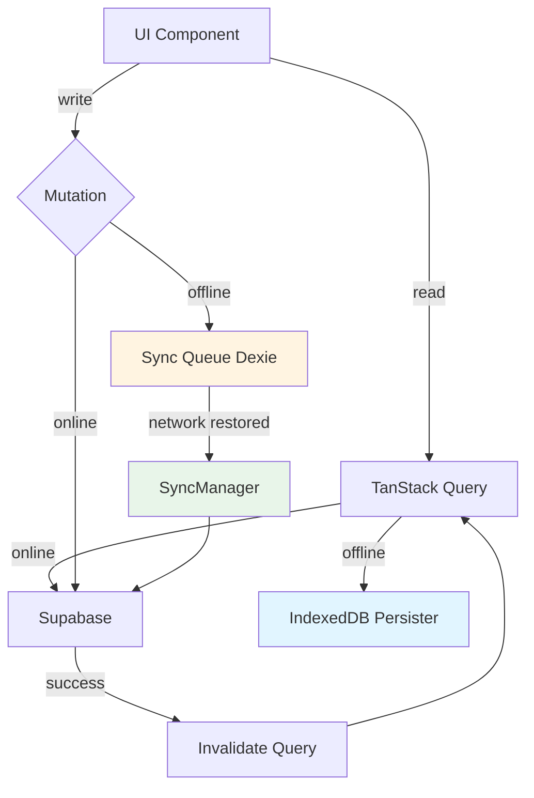

# Офлайн-режим и синхронизация данных

## Обзор

Pennora поддерживает полный офлайн-режим работы с автоматической синхронизацией данных при восстановлении сетевого соединения. Это обеспечивает непрерывную работу приложения даже без подключения к интернету.

## Архитектура

### Гибридный подход

Приложение использует комбинацию двух технологий для обеспечения офлайн-режима:

1. **TanStack Query + IndexedDB persister** — для офлайн-чтения данных
2. **Dexie + очередь операций** — для офлайн-записи данных

### Схема потока данных



## Компоненты системы

### 1. IndexedDB Persister для TanStack Query

**Файлы:**

- `lib/db/indexeddb/persister.ts` — адаптер для IndexedDB
- `lib/query/persist.ts` — настройка персистентного кеширования

**Назначение:**

- Обеспечивает офлайн-доступ к данным после первой загрузки
- Автоматически работает через TanStack Query
- Поддерживает больший объем данных, чем localStorage (~50MB vs 5-10MB)
- Поддерживает нативные типы JavaScript (Date, File)

**Как работает:**

1. При первом запросе данные загружаются из Supabase
2. Данные автоматически сохраняются в IndexedDB через persister
3. При последующих запросах (в том числе офлайн) данные загружаются из IndexedDB
4. TanStack Query автоматически переключается в режим `offlineFirst`

**Персистируемые данные:**

- Категории (редко меняются)
- Транзакции (для офлайн-доступа)

### 2. Очередь синхронизации (Dexie)

**Файлы:**

- `lib/db/indexeddb/database.ts` — база данных Dexie для очереди
- `lib/db/indexeddb/models.ts` — типы для очереди
- `lib/sync/queueManager.ts` — менеджер очереди

**Назначение:**

- Хранит несинхронизированные операции записи
- Обеспечивает надежное сохранение операций при офлайн-режиме
- Минимальная структура данных (не дублирует основные данные)

**Структура очереди:**

```typescript
interface SyncQueueItem {
  id: string; // UUID операции
  table: "transactions" | "categories" | "accounts";
  operation: "create" | "update" | "delete";
  record_id: string | null; // null для create
  data: unknown; // Данные операции
  created_at: number; // Timestamp
  retry_count: number; // Количество попыток
  last_error: string | null; // Последняя ошибка
}
```

### 3. Менеджер синхронизации

**Файлы:**

- `lib/sync/syncManager.ts` — основной менеджер
- `lib/stores/syncStore.ts` — Zustand store для состояния

**Функциональность:**

- Автоматическая синхронизация при восстановлении сети
- Периодическая синхронизация (каждые 5 минут)
- Обработка очереди операций батчами
- Инвалидация кеша TanStack Query после успешной синхронизации
- Обработка ошибок с retry логикой

**Стратегия синхронизации:**

- **Last-Write-Wins** — автоматическое разрешение конфликтов по `updated_at`
- **Батчинг** — группировка операций для производительности
- **Retry** — до 5 попыток с экспоненциальной задержкой

### 4. Интеграция с mutations

**Файлы:**

- `lib/query/mutations/transactions.ts`
- `lib/query/mutations/categories.ts`
- `lib/utils/network.ts` — утилиты для определения сетевых ошибок

**Логика работы:**

1. При успешной операции — данные отправляются в Supabase
2. При сетевой ошибке:
   - Операция добавляется в очередь синхронизации
   - Оптимистичное обновление UI сохраняется
   - Пользователю показывается сообщение о будущей синхронизации
3. При других ошибках — откат оптимистичного обновления

### 5. UI компоненты

**Файлы:**

- `components/features/sync/SyncStatus.tsx` — компонент статуса
- `lib/hooks/useSync.ts` — хук для работы с синхронизацией

**Функциональность:**

- Индикатор офлайн/онлайн режима
- Количество операций в очереди
- Кнопка ручной синхронизации
- Время последней синхронизации
- Статус синхронизации (idle, syncing, success, error)

## Использование

### В компонентах

```typescript
import { useSync } from "@/lib/hooks/useSync";

function MyComponent() {
  const { isOnline, isSyncing, pendingOperations, syncNow } = useSync();

  return (
    <div>
      {!isOnline && <p>Офлайн режим</p>}
      {pendingOperations > 0 && (
        <button onClick={() => syncNow()}>
          Синхронизировать ({pendingOperations})
        </button>
      )}
    </div>
  );
}
```

### Компонент SyncStatus

Компонент автоматически отображается в layout приложения и показывает:

- Статус подключения к сети
- Количество ожидающих операций
- Кнопку для ручной синхронизации

```tsx
import { SyncStatus } from "@/components/features/sync/SyncStatus";

// В layout
<SyncStatus />;
```

## Настройка

### Инициализация

Синхронизация инициализируется автоматически в `QueryProvider`:

```typescript
// lib/query/provider.tsx
useEffect(() => {
  syncManager.initialize();
}, []);
```

### Конфигурация

Настройки синхронизации можно изменить в:

- `lib/sync/syncManager.ts` — интервал периодической синхронизации
- `lib/sync/queueManager.ts` — максимальное количество попыток retry
- `lib/query/persist.ts` — какие данные персистируются

## Производительность

### Метрики

- **Время загрузки из IndexedDB**: < 100ms
- **Размер очереди**: обычно < 1MB (зависит от количества операций)
- **Время синхронизации**: ~50-200ms на операцию (зависит от сети)

### Оптимизация

1. **Батчинг операций** — группировка по 10 операций за раз
2. **Индексы в Dexie** — быстрый поиск операций
3. **Очистка старых операций** — автоматическая очистка операций старше 7 дней

## Troubleshooting

### Данные не синхронизируются

1. Проверить статус сети: `navigator.onLine`
2. Проверить очередь операций: `queueManager.getAll()`
3. Проверить ошибки в консоли браузера
4. Запустить синхронизацию вручную: `syncManager.syncAll()`

### Очередь не очищается

1. Проверить, что операции успешно выполняются в Supabase
2. Проверить ошибки в `last_error` полях очереди
3. Увеличить `retry_count` лимит, если нужно

### IndexedDB не работает

1. Проверить поддержку IndexedDB в браузере
2. Проверить квоты хранилища (обычно ~50MB)
3. Проверить консоль на ошибки Dexie

## Безопасность

- Все операции в очереди содержат только данные пользователя
- Данные не покидают устройство до синхронизации
- При синхронизации используется существующая аутентификация Supabase
- RLS политики Supabase применяются при синхронизации

## Ограничения

1. **Размер IndexedDB**: ограничение ~50MB на домен
2. **Конфликты**: автоматическое разрешение через Last-Write-Wins
3. **Одновременное редактирование**: последнее изменение побеждает

## Будущие улучшения

- [ ] Ручное разрешение конфликтов через UI
- [ ] Синхронизация через Supabase Realtime
- [ ] Сжатие данных в очереди
- [ ] Приоритизация операций в очереди
- [ ] Метрики и аналитика синхронизации
